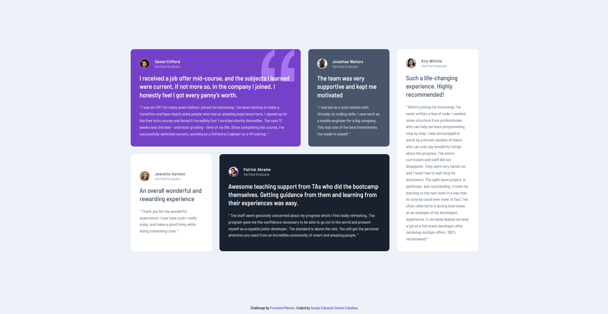

# Frontend Mentor - Testimonials grid section solution

This is a solution to the [Testimonials grid section challenge on Frontend Mentor](https://www.frontendmentor.io/challenges/testimonials-grid-section-Nnw6J7Un7). Frontend Mentor challenges help you improve your coding skills by building realistic projects.

## Table of contents

- [Overview](#overview)
  - [The challenge](#the-challenge)
  - [Screenshot](#screenshot)
  - [Links](#links)
- [My process](#my-process)
  - [Built with](#built-with)
  - [Useful resources](#useful-resources)
- [Author](#author)

## Overview

### The challenge

Users should be able to:

- View the optimal layout for the site depending on their device's screen size

### Screenshot

### Links

- Solution URL: [Frontend Mentor Solution](https://your-solution-url.com)
- Live Site URL: [Netlify](https://fm-testimonial-section-challenge.netlify.app/)

## My process

1. Analyze the designs
2. Implement my CSS reset code
3. Add all the root/global values as well as any utility class I might need
4. Create the structure in the html files (utilizing the BEM methodology)
5. Add the section/component specific styling

### Built with

- Semantic HTML5 markup
- CSS custom properties
- Flexbox
- CSS Grid
- Mobile-first workflow
- Scss
- Responsive Design

### Useful resources

- [Google Fonts](https://fonts.google.com/) - Best website for web fonts.
- [The Clamp Calculator](https://royalfig.github.io/fluid-typography-calculator/) - Great online calculator for fluid typography (clamp).
- [CSS Grid Layout Guide](https://css-tricks.com/snippets/css/complete-guide-grid/) - Quick cheat sheet to remember the CSS Grid properties.

## Author

- Website - [Sergio Eduardo Castro Ceballos](https://sergiocas.com/)
- Frontend Mentor - [@SergioCasCeb](https://www.frontendmentor.io/profile/SergioCasCeb)
- LInkedIn- [Sergio Eduardo Castro Ceballos](www.linkedin.com/in/sergio-eduardo-castro-ceballos)